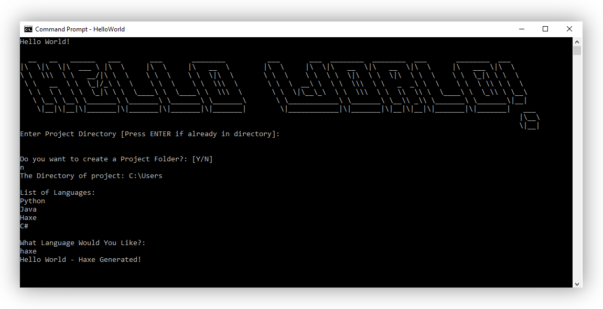

<!-- PROJECT LOGO -->
<br />
<div align="center">
<h1 align="center">Hello World! :)</h1>
  <a href="https://github.com/BotRandomness/HelloWorld">
    
  </a>

<h3 align="center">Hello World, a CLI tool to generate Hello World Projects, written in C#.</h3>

</div>

<!-- ABOUT THE PROJECT -->

## About The Project

<a href="https://github.com/BotRandomness/HelloWorld">
    
</a>

(Image showing 1.0V build, First Commit) </br>
</br>
As my first Github respository, what naturally comes to mind is to make a "Hello World" repo with a readme. I decided that if I was going to upload a "HelloWorld" respository, I might as well make it over the top. I present to you... a **HELLO WORLD CLI**! Yes, a CLI tool to help you generate Hello World projects for different languages and project frameworks, such as for **Python, C#, Haxe, C++, Rust, and MORE** (Look at language list in the Usage section)! The best part is that this is completely **open source** under the MIT license. ANYONE is free to **CONTRIBUTE**. I plan on to add extra features and content, look at features section for more detail.
</br></br>
Is this too over the top for just a "Hello World" project? Yes, for sure. Is it worth it? Definitely! :)

<!-- GETTING STARTED -->

## Getting Started

Want to help the development of this project? Of course you want to! This project is purely writen in C#, so you would be needed .NET (dotnet). .NET is a framework made by Mircosoft, it's cross-platform, and open-source. .NET here is what we use to compile our C# code! .NET 7 or .NET 6 both should work with this. You can download it here: https://dotnet.microsoft.com/en-us/download </br>

I used Visual Studio Code, a text editor, you can also VS Code or any other text editor, or you can use an IDE like Visual Studio. </br>

Do note that I try making this cross-platform as possible, however, I was only able to test on Windows. I will try to test on MacOS and Linux based systems, later on, maybe someone could also test it and let me know :)

### Compiling

Now that you have .NET, it's compiling time! .NET makes it super easy to compile. Let's open the terminal, and run some commands.

- First point the terminal to your project directory.
  ```sh
  cd [PROJECT PATH]
  ```
  - To run and test the code with debug build, enter this command.
  ```sh
  dotnet run
  ```
  - If you now want to make a build, this is the command we use.
  ```sh
  dotnet build -o build
  ```
  The "-o" here is what we call a flag, this is essentially saying output the build to the "build" folder, which would be made automatically. We can distribute this to others, but it's more for yourself, so there is another command very similar to dotnet build called dotnet publish
  </br>
  - dotnet publish is very similar to dotnet build, except dotnet publish has bit more flags dedicated for distribution.
  ```sh
  dotnet publish -o publish
  ```
  The build and publish are very similar, and most the flags are the same with a few addition you may or may not use, so you could technically use either for final distribution, the choice is yours.
  
  Do note if you make a build/publish like this, .NET will compile the project assuming that your building the program for whatever your OS and CPU architechture, and the program will also be .NET framework dependent. You can add more flags to build for other OSs and CPU architechture and also make it not .NET framework dependent. Heres a link to Mircosoft .NET docs, outlining these different flags: </br>
  dotnet build: https://learn.microsoft.com/en-us/dotnet/core/tools/dotnet-build </br>
  dotnet publish: https://learn.microsoft.com/en-us/dotnet/core/tools/dotnet-publish </br>

### Program Architechture

Heres a little bit on the program layout! </br></br>

C# is a very object oriented language, as such, each object, which are their own files, are performing certain task. Then the methods in thoses classes, again perform specific task, realting to the overall goal of the of that class. Heres an example: </br>

The `FileManager.cs` has a class called `FileCopier`. The job of this class has a broad goal, simply copying a file from 'CodeBank' and pasting where the user wants the file to be placed. Now a method in that class is `DirectoryManager()`, which has the specific task to get user input on where they want the file to be placed, and then method would return a file path. The class and the method will then called in the `Program.cs` file. </br>

Most of the program is writen like this. This sort of approach has the great benefit of being very modular, and adds more flexable as the methods and classes aren't tied to much, and work mostly independently. This makes it so easy to debug certain aspect and features of the program, and makes it less likely that you would accidentally mess something else up. </br> </br>

Quickly going to talk about how the `SaveData.txt` works. The layout of that file when you open it: </br>

```
//[Even Number] Some sort of header text
[Odd Number]****
```

The numbers here represent a index number, since in C#, when you load in a file, each line is index into a array starting from 0. I refer to a pair of even and odd number as a `slot`. A `slot` contains a even number which is just a header saying what the data is for, while the odd number is where the data written to. These numbers are helpful when trying to know what array index a `slot` is at. The first 2 save `slot` is used to save the old `PATH` variable and the new `PATH` variable, which is to called the HelloWorld CLI from the terminal in any directory.

<!-- USAGE EXAMPLES -->

## Usage

Want to know how to use it? It's very simple! :)

### Setup

After downloading the zip file, or once you compiled it yourself, make sure you move the folder containing the exacutable and all of it's necessary files your desired location. I reconmend you put it in a place where it will stay in one place. To setup, just launch the application, and the setup will activate itself, and the application location will add itself to your `local PATH` variable, which will allow you to call it from the terminal for faster and for a more pratical use (this why I reconmend keeping it on a place where it will stay).

### Uninstall

If you want to uninstall, it's also simple. Just delete the application folder. That's pretty much it. Further more, I reconmend is to go into your `local PATH` variable, and remove the applications location from there as well.

### Syntax

To launch, in your terminal (which could be pointed to any directory), simply write `HelloWorld`. </br>
This will launch the CLI, and you can answer the prompted step by step questions for the desire output. However, if you want bypass the questions, and have the information enter before hand for faster use, we can use `command flags` </br>

The genaral syntax: </br>
`--flag [INPUT]` </br>

The Flags:

- `-l` Takes what language you want to genarate
- `-o` Takes the path of the output directory for the genarated file
- `-c` If you want the output directory to be your current directory, this take no inputs
- `-f` Takes in "Y" (Yes) or "N" (No) if you want to also genarate a project folder to put genarated file in
- `-s` :)

These flags are flexible, as in you can use one or two of these flags, and the rest unused flags, question will be prompted instead. </br>

Here are some of the supported languages that can be genarated (So far): </br>

Language List (So far):

- `Python`
- `Java`
- `Haxe`
- `CS` (C#)
- `CPP` (C++)
- `C`
- `JavaScript`
- `Go`
- `Rust`
- `Lua`
- `Ruby`
- `Swift`

Few Example Commands: </br>
`HelloWorld -c -l haxe` </br>
`HelloWorld -f n -o C:\User -l python` </br>
`HelloWorld -l cs` </br>
`HelloWorld` </br>

<!-- ROADMAP -->

## Features

- Easily call the `HelloWorld` from the terminal anywhere
- Flags for faster use
- A `CodeBank` making very easy to genarate Hello World files/Projects supporting many languages currently

### Upcoming Features

- [ ] ADD MORE LANGUAGES!!! :)
  - Dart, Objective-C, Assembly languages, Legacy languages, esoteric languages, etc
- [ ] Add more "Hello World" projects for other framworks and engines
  - Godot, Unity, other game engines :), NodeJs Projects
- [ ] User customizability support, as in they can genarate their own files
  - Very useful if the user uses a certain format a lot of times, it doesn't neeed to be "Hello World" realted
- [ ] Have a option to automatically to exacute the code for the user after being genarated
  - User would have to do a One Time Set-Up of the compiller path/command for a language 
- [ ] Make a help flag to easily see syntax
- Post any feature request in the Issues tab!

## Known issues

- Writing a invaild folder name when the user is ask to name their genarated folder, will crash the program
- When using the `-o` flag, the user inputs a path that has a folder with a space in it, the program will see it as invaild path
  - This only applies when using the `-o` flag, when prompted question, it works normally
- Using the both `-o` and `-c` flag together at once can confuse the program
  - The program will not crash, but use what flag came first
- If you find any other issues/bugs, post about it on the issues tab
  - Also provide what version your using (as well OS, CPU), and how to reproduce it

<!-- CONTRIBUTING -->

## Contributing

As said, anyone is free to contribute! Make sure whatever you plan to contribute is meaningful in some way. This repository is for everyone, it does not matter of your experience in coding and in git, or if your new to all of it!

If you plan on contributing, a good place to start is to look at upcoming wanted features, and known issues. If you find a new bug, or have feature ideas of your own, posted first to the Issues tab before hand. </br>

To get started on contributing:

1. Fork or Clone the Project
2. Once you have your own repository (it can be a public repository) to work in, you can get started on what you want to do!
3. Make sure you git Add and git Commit your Changes to your repository
4. Then git push to your repository
5. Open a Pull Request in this repositroy, where your changes will be look at to be approved
6. Once it's approved, it will be in a development branch, soon to be merge to the master branch

<!-- LICENSE -->

## License

Distributed under the MIT License. See `LICENSE.txt` for more information.
